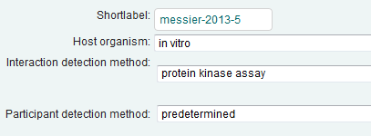
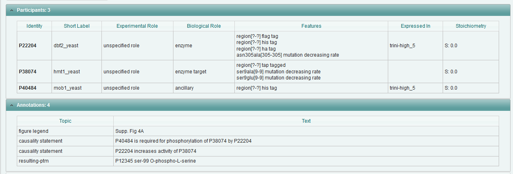
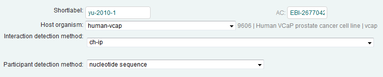
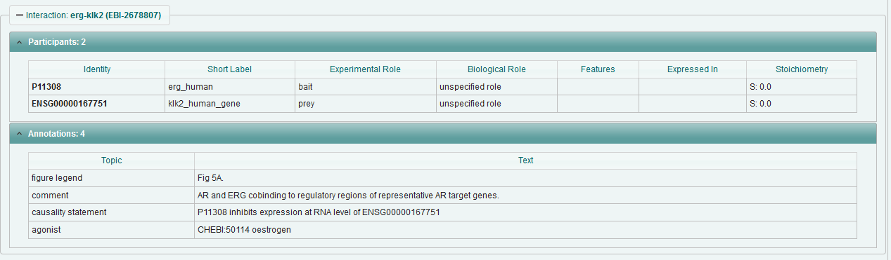

**Causal Interaction Annotation – draft annotation rules**

1.  Interactions to which this annotation is added should be ‘interaction type = direct’ (or child term), with the exception of Ch-IP, which must follow existing limitations i.e. cross-linked data will be captured only.

2.  Causality must be experimentally demonstrated in the same paper. Inferred causality, or references to external publications, should not be captured.

3.  Causality will be captured at the Interaction level, using the annotation comment ‘Causality Statement’

4.  Causality statements will be made using the following controlled vocabulary

> activates
>
>   increases activity of (Up-regulates)
>
>       increase quantity of
>
>       increase expression of
>
> increase expression at RNA level of
>
> increase expression at protein level of
>
> decreases degradation of
>
> decreases degradation of RNA level of
>
> decreases degradation of protein levels of
>
> inhibits
>
> decreases activity of (Down-regulates)
>
> decreased quantity of
>
> decreases expression of
>
> decreases expression at RNA level of
>
> decreases expression at protein level of
>
> increases degradation of
>
> increases degradation of RNA level of
>
> increases degradation of protein levels of
>
> Is required for

1.  Causality statements should be made using UniProtKB, ChEBI or Ensembl identifiers as appropriate

    Template

    Identifier [causality statement] identifier

    Identifier [is required for] the [CV term/causality statement] of Identifier by Identifier

2.  When an interaction results in a PTM being added to the substrate, capture this using the following syntax

    Annotation topic ‘resulting-ptm’ free text Identifier amino acid-three letter code-residue number [MOD CV term]

    e.g. P12345 ser-99 O-phospho-L-serine

> **Examples**
>
> **PMID: 23706744** EBI-8764995
>
> P48084 is required for phosphorylation of P38074 by P22204

P22204 increases activity of P38074

> **PMID: 20478527** EBI-2678807
>
> P11308 inhibits expression at RNA level of ENSG00000167751
>
> 
>
> 
>
> **PMID: 23910378** EBI-8795658
>
> CHEBI:75947 activates Q86WV6
>
> **PMID: 10390359** EBI-8764357
>
> P27958-PRO\_0000037570 inhibits activity of P19525
